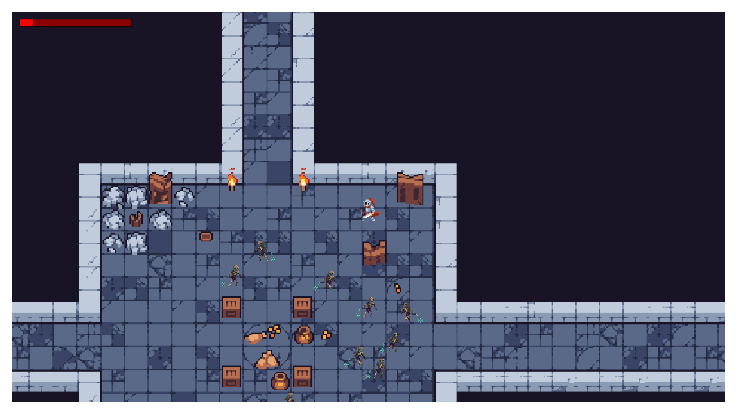

# Name: The Conqueror of Dungeons
**2D pixel game with top view**

*You are a hero fighting your way through rooms with monsters*

*Your goal is to reach the final boss and defeat him*

*Fight enemies in every room*

*Use a sword and special techniques*

*After death, you will have to go through the game again*

# TK

**The purpose of the game:**  
Destroy the monsters, complete all the levels and the final boss

**Game cycle:**  
The player controls the character ->  
The character is fighting ->   
Game status changes (health, monsters) ->    
The game ends after the boss is destroyed.  

**Management:**     
WASD keys: move the character     
ESC: Exit the menu

# Название: The Conqueror of Dungeons
**2D пиксельная игра с видом сверху**

*Вы - герой, пробивающийся через комнаты с монстрами*

*Ваша цель - добраться до финального босса и победить его*

*Сражайтесь с врагами в каждой комнате*

*Используйте меч и особые приемы*

*После смерти вам придется проходить игру заново*

# ТЗ

**Цель игры:**  
Уничтожить монстров, пройти все уровни и финального босса

**Игровой цикл:**  
Игрок управляет персонажем ->  
Персонаж сражается ->   
Изменяется состояние игры (здоровье, монстры) ->    
Игра заканчивается после уничтожения босса  

**Управление:**     
Клавиши WASD: перемещение персонажа     
ESC: Выход в меню

